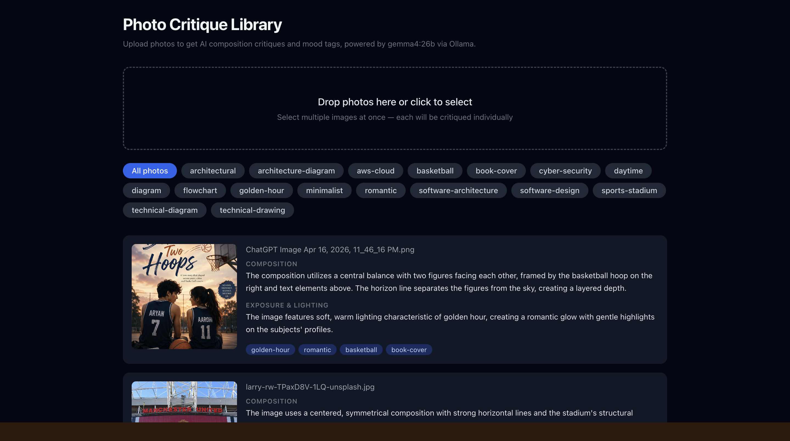

# Photo Critique & Auto-Tagger

A personal photo library that uses a local vision model to give you **AI-generated composition and lighting critiques** plus **auto-generated mood/subject tags** for every photo you upload — all stored persistently so it grows into a searchable library over time.



---

## Features

- **Batch upload** — drag-and-drop or file-picker, multiple photos at once
- **Per-photo AI critique** — composition analysis (rule of thirds, framing, leading lines) and exposure/lighting assessment, powered by `gemma4` via Ollama
- **Auto-tagging** — 2–4 mood and subject tags per photo (e.g. `golden-hour`, `portrait`, `moody`, `street`)
- **Live processing state** — each card shows a spinner while the model works; results appear as they finish without a page reload
- **Clickable tag filters** — click any tag to filter the gallery; click again to clear
- **Persistent library** — photos, critiques, and tags survive server restarts (SQLite + local file storage)

---

## Tech Stack

| Layer | Technology |
|---|---|
| Backend | Python · FastAPI · SQLAlchemy (SQLite) |
| Vision model | [Ollama](https://ollama.com) · `gemma4:31b` on a RunPod GPU pod |
| Frontend | Next.js 14 (App Router) · TypeScript · Tailwind CSS |

---

## Prerequisites

- Python 3.11+
- Node.js 18+
- An [Ollama](https://ollama.com) instance with a vision-capable model pulled, reachable over HTTP (local or remote — e.g. a [RunPod](https://runpod.io) GPU pod)

---

## Backend Setup

```bash
cd backend

# Create and activate a virtual environment
python3 -m venv .venv
source .venv/bin/activate        # Windows: .venv\Scripts\activate

# Install dependencies
pip install -r requirements.txt

# Configure environment variables
cp .env.example .env
# Edit .env — set OLLAMA_URL and optionally OLLAMA_MODEL
```

**.env** (minimum required):
```env
OLLAMA_URL=https://<your-pod-id>-8888.proxy.runpod.net
OLLAMA_MODEL=gemma4:31b
```

```bash
# Start the API server
uvicorn app:app --port 8000
```

Uploaded images are saved to `backend/uploads/` and the database lives at `backend/photos.db`. Both persist across restarts.

---

## Frontend Setup

```bash
cd frontend

npm install

# (Optional) override the API URL — defaults to http://localhost:8000
cp .env.local.example .env.local

npm run dev
```

Open [http://localhost:3000](http://localhost:3000).

---

## Usage

1. **Drop photos** onto the upload zone or click to pick files — select as many as you want at once.
2. Cards appear immediately with a loading spinner while the model analyses each image.
3. Once done, each card shows:
   - **Composition** — rule of thirds, framing, balance, leading lines, etc.
   - **Exposure & Lighting** — quality, mood, highlights/shadows
   - **Tags** — 2–4 short descriptors like `golden-hour`, `street`, `minimalist`
4. **Filter by tag** — click any tag chip (on a card or in the filter bar at the top) to show only matching photos. Click the active tag or **All photos** to clear the filter.

---

## API Reference

| Method | Path | Description |
|---|---|---|
| `POST` | `/upload` | Upload one or more images (`multipart/form-data`, field name `files`) |
| `GET` | `/photos` | List all photos; `?tag=moody` filters by tag |
| `GET` | `/photos/{id}` | Single photo with critique and tags |
| `GET` | `/tags` | All tags with photo counts |
| `GET` | `/uploads/{filename}` | Serve a stored image file |

---

## Project Structure

```
photo-critique/
├── backend/
│   ├── app.py              # FastAPI app — routes, models, Ollama call
│   ├── requirements.txt
│   ├── .env.example
│   ├── uploads/            # Stored image files (git-ignored)
│   └── photos.db           # SQLite database (git-ignored)
└── frontend/
    ├── app/
    │   ├── page.tsx         # Main gallery page
    │   ├── types.ts         # Shared TypeScript types
    │   └── components/
    │       ├── UploadZone.tsx
    │       ├── PhotoCard.tsx
    │       └── TagFilter.tsx
    └── ...config files
```
